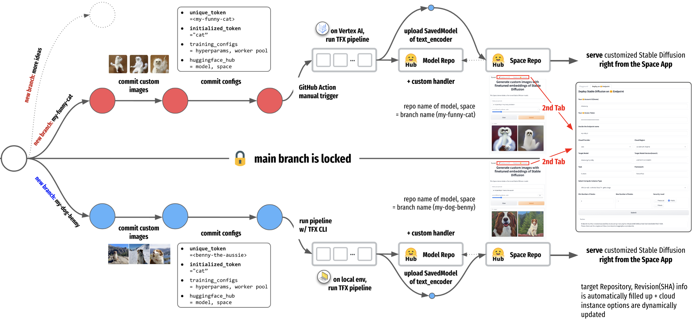
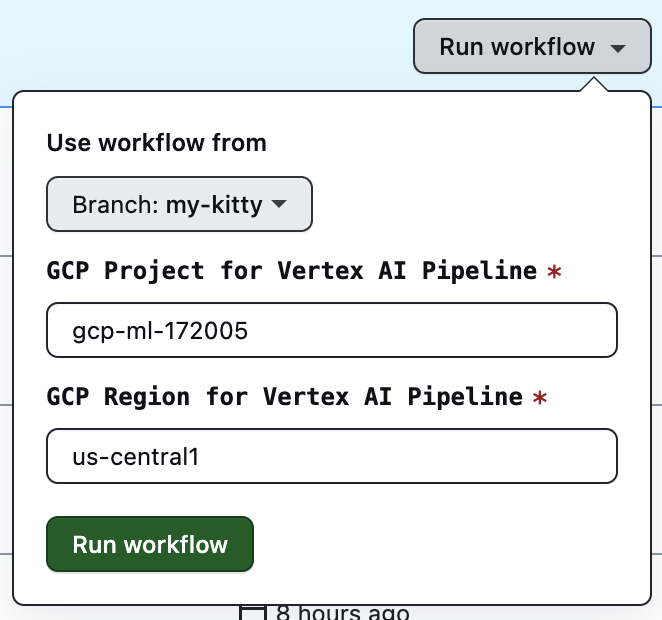
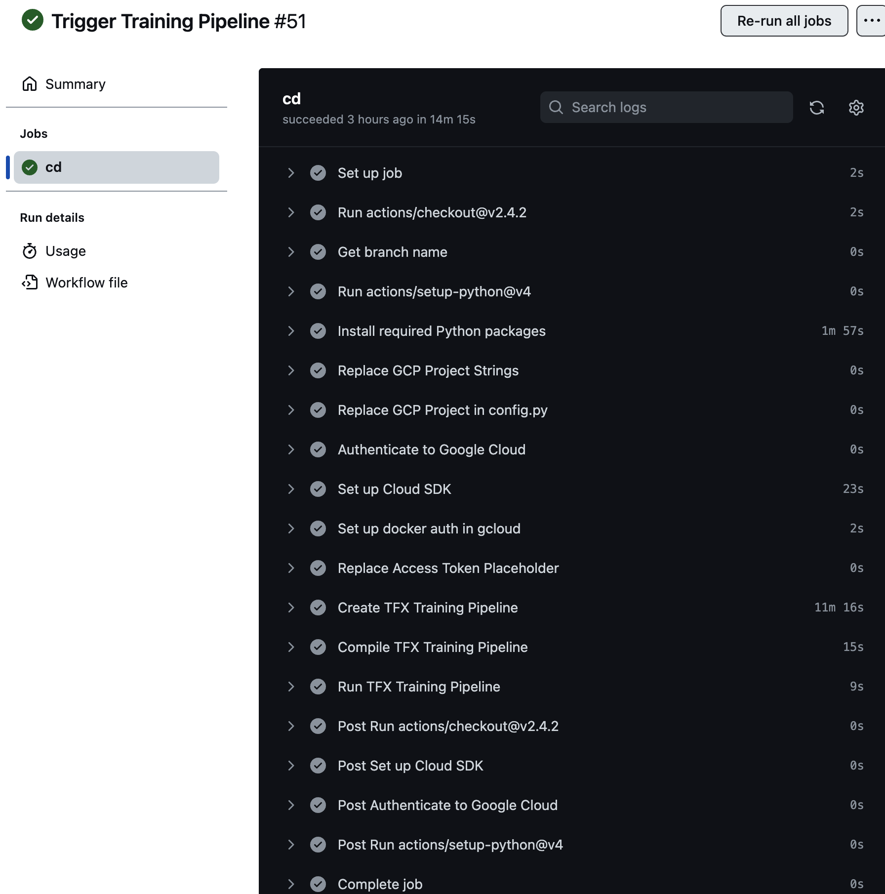
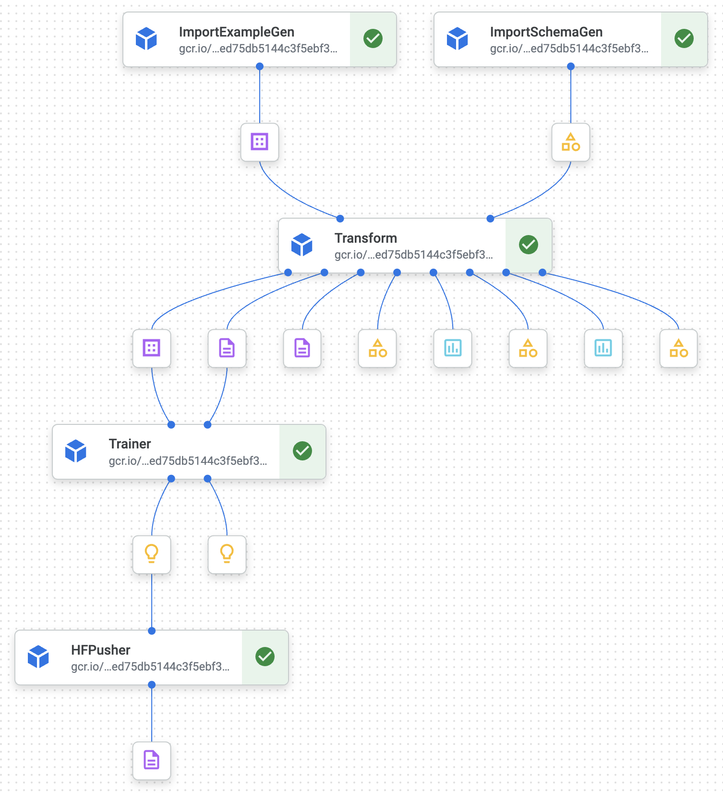
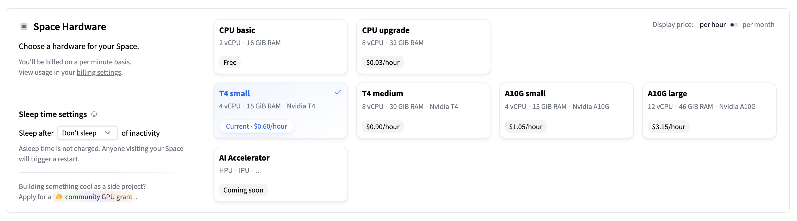
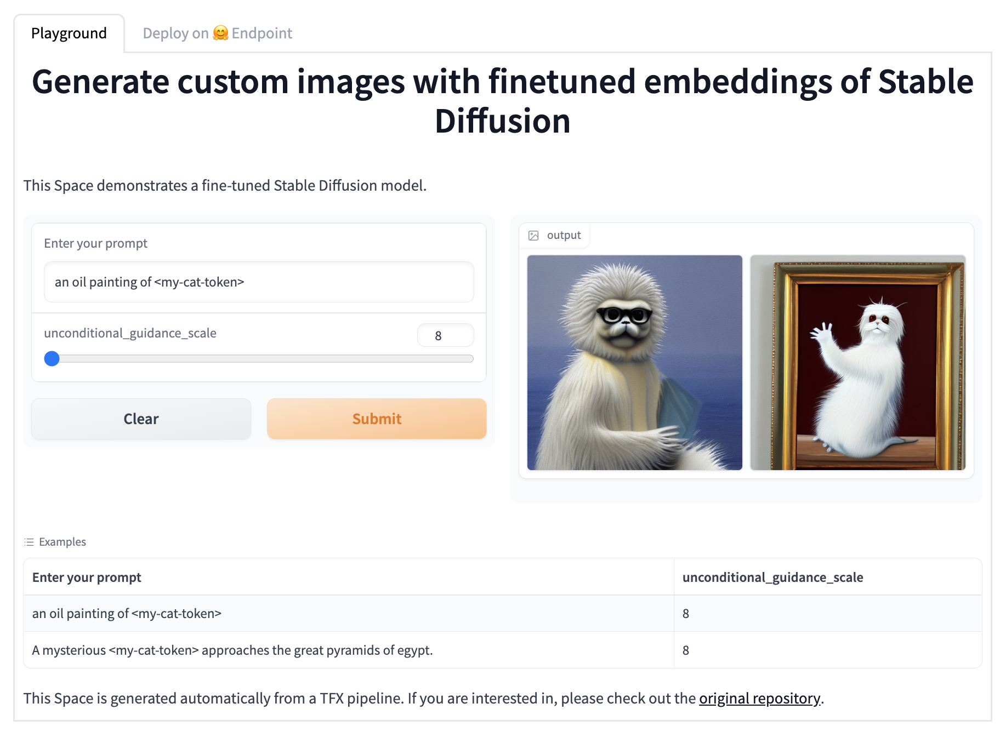
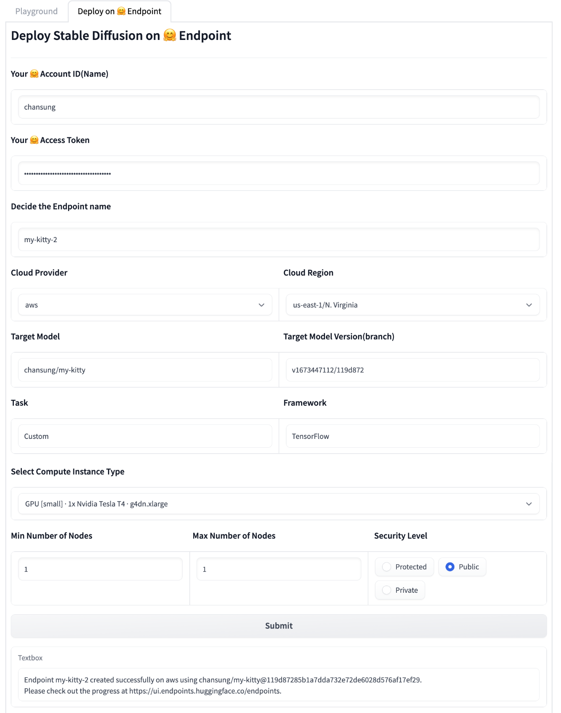

# Textual Inversion Pipeline for Stable Diffusion

This repository demonstrates how to manage multiple models and their prototype applications of fine-tuned Stable Diffusion on new concepts by [Textual Inversion](https://textual-inversion.github.io/).

## Overview

In this section, I am going to explain the whole workflow and how to use it. There are some parts that need to be done manually, and there are some parts that are done automatically, so I will indicate each cases with the letter **[M]** and **[A]**.

1. **[M]** create a new branch and checkout
    - the branch name is going to be the name of the pipeline, Hugging Face Model repository, and Hugging Face Space repository for easier tracking.
2. **[M]** upload your own images in the `training_pipeline/data` directory
3. **[M]** serialize the images with `TFRecord` format by running the following command, then the generated `TFRecord` file will be placed in `training_pipeline/tfrecords`.
    - `$ python data/create_tfrecords.py`
4. **[M]** customize the values of the following variables in `training_pipeline/pipeline/configs.py`.
    - (optional) `TRAINING_EPOCH`: how many epochs to train
    - `PLACEHOLDER_TOKEN`: a unique token for your own concept
    - `INITIALIZED_TARGET_TOKEN`: an existing token. the weights of the corresponding token is going to be used as the initial weights of your own token(`PLACEHOLDER_TOKEN`)
5. **[M]** (optional) customize title and emoji of the Hugging Face Space application in `training_pipeline/huggingface/apps/gradio/textual_inversion/README.md`.
6. **[M]** commit and push the changes
7. **[M]** run the `Trigger Training Pipeline` GitHub Action workflow. Make sure you set the correct branch to run it on.
    - GitHub Action looks up two GitHub Secrets to fill some info in the `configs.py`
      - `YOUR_GCP_PROJECT_ID`: the key of this Secret should exactly match your GCP Project ID except that dashes are replaced with underscores. The value of the Secret should be the GCP credentials in JSON format.
      - `HF_ACCESS_TOKEN`: the value of this Secret should be the Hugging Face Access token.

  

8. **[A]** `Trigger Training Pipeline` GitHub Action workflow is triggered, and it does the following jobs.
    - retreive branch name and replace `$PIPELINE_NAME` with it.
    - install python packages via `training_pipeline/requirements.txt`.
    - authenticate Google Cloud with `google-github-actions/auth` GitHub Action, the `YOUR_GCP_PROJECT_ID` GitHub Action Secret is going to be used here.
    - replace `$HF_ACCESS_TOKEN` inside `configs.py` with the `HF_ACCESS_TOKEN` GitHub Action Secret. 
    - create TFX pipeline and build a new Docker image with the current code base.
    - run TFX pipeline on Vertex AI platform in GCP.

  

9. **[A]** TFX pipeline on Vertex AI handles the following jobs in a row.
    - `ImportExampleGen` component takes input(training) `TFRecord` data stored under `training_pipeline/tfrecords` directory.
    - `Transform` component transform the TFRecord data from `ImportExampleGen` into appropriate shapes with the help of `ImportSchemaGen`. `ImportSchemaGen` simply loads up schema information defined in Protocol Buffer Text format under `training_pipeline/pipeline/schema.pbtxt`.
    - `Trainer` component trains the embedding layers inside `text_encoder` of Stable Diffusion with the training data from `Transform` component. It trains in Vertex AI Training, and the worker spec is defined in `configs.py` (default to use a single A100 instance), and the `text_encoder` with the trained additional embedding layers is saved as `SavedModel` format.
    - `HFPusher` component pushes `text_encoder` to a repository of Hugging Face Models. If there is no repository named as the pipeline name under your account, one will be created. Whenever a model is pushed to the same repository, the model will be pushed to the new branch name `v...`. It additionally pushes the files under `training_pipeline/huggingface/models/custom_handler`.
        - `HFPusher` also pushes the source codes under `training_pipeline/hugging_face/apps/gradio/textual_inversion` to a repository of Hugging Face Spaces. If there is no repository named as the pipeline name under your account, one will be created. Space application codes will always be replaced in the `main` branch in every pushes.
        - some special strings inside files in `training_pipeline/huggingface/models/custom_handler` and `training_pipeline/hugging_face/apps/gradio/textual_inversion` will be replaced at runtime such as the model repository name, model version(branch name), commit SHA, and unique placeholder token.

  

10. **[M]** Change the Hardware spec of the Hugging Face Space to `T4 small` since Stable Diffusion can not be run on CPU instance.

  

11. **[M]** Play with the app under `Playground` tab.

  

12. **[M]** Deploy the Stable Diffusion with the current version of `text_encoder` on Hugging Face Inference Endpoint under `Deploy on 🤗 Endpoint` tab. 
    - Your account name, Hugging Face access token, and the Endpoint name should be filled.
    - After clicking `Submit` button, check out the Endpoint creation progress via `https://ui.endpoints.huggingface.co/endpoints`.

  

## Tech Stack

- Stable Diffusion ([KerasCV official](https://github.com/keras-team/keras-cv/tree/master/keras_cv/models/stable_diffusion)) - `keras_cv==0.4.0`
- Machine Learning Pipeline ([TensorFlow Extended](https://www.tensorflow.org/tfx)) - `tfx==1.12.0`
- Cloud ML Pipeline ([Vertex AI Pipeline](https://cloud.google.com/vertex-ai/docs/pipelines/introduction))
- Cloud ML Training ([Vertex AI Training](https://cloud.google.com/vertex-ai/docs/training/custom-training))
- Automated Pipeline Triggering ([GitHub Action](https://github.com/features/actions))
- Model Registry ([Hugging Face Models](https://huggingface.co/models))
- Hosting Prototype Application ([Hugging Face Spaces](https://huggingface.co/spaces))
- Stable Diffusion Deployment ([Hugging Face Inference Endpoint](https://huggingface.co/inference-endpoints))

> I refered to the example of Textual Inversion from the [Keras official tutorial](https://keras.io/examples/generative/fine_tune_via_textual_inversion/).